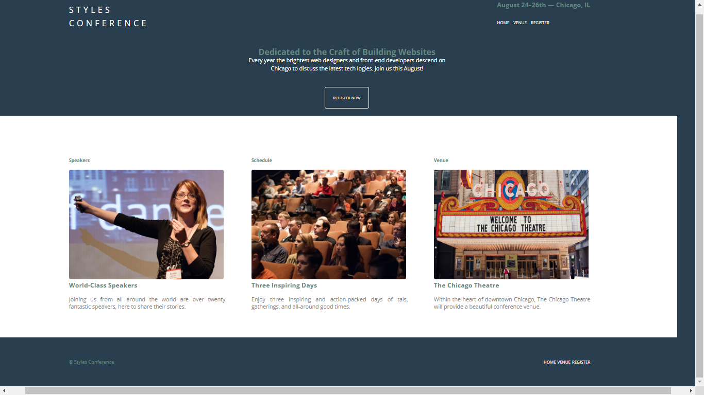

# STYLES-CONFERENCE
 This is an practical project to practice to  our skills in HTML,CSS  and javascript.
## Author
* UMAR MUSA
* YUSUF QUEEN
## Live demo
[See project live here] (https://raw.githack.com/Musa-1995/STYLES-CONFERENCE/main/index.html)

## Functionalities
It is a three page website
It can be use to register for the conference
It also contain the nagivation map

### Features

* schedule
* venue
* register

## The prototype of the app

## Developed with
* HTML
* CSS 
* JavaScript

## Editor used
Vscode

## Contact
### UMAR MUSA
[Twitter](https://www.twitter.com/Musa_Bin_Umar)
[Facebook](https://www.facebook.com/Binumar4/)
[LinkedIn](https://www.linkedin.com/mwlite/in/musa-umar-646502179)
### QUEEN YUSUF
[Twitter](https://twitter.com/QueenYusuf8/status/1308727777152110592)
[Facebook](https://web.facebook.com/?_rdc=1&_rdr)
[LinkedIn](https://www.linkedin.com/feed/)

